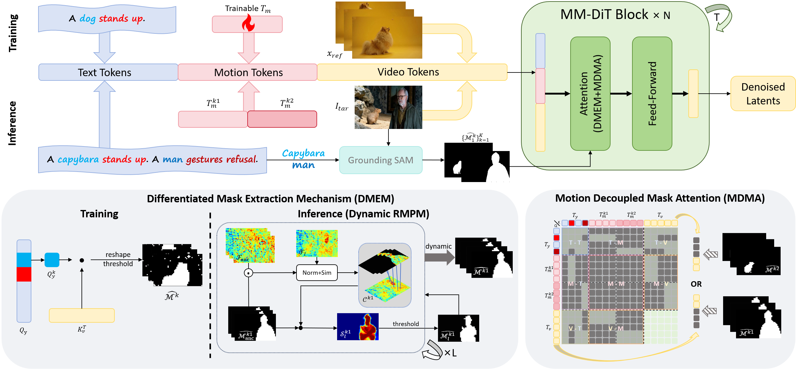

<div align="center">

# Let Your Image Move with Your Motion! – Implicit Multi-Object Multi-Motion Transfer

Accepted by CVPR 2026

 [Yuze Li](https://github.com/Ethan-Li123)<sup>1</sup>, [Dong Gong](https://donggong1.github.io/)<sup>2</sup>, Xiao Cao<sup>3</sup>, Junchao Yuan<sup>1</sup>, Dongsheng Li<sup>1</sup>, [Lei Zhou](https://hnu-ov.github.io/index.html)<sup>4</sup>, [Yun Sing Koh](https://profiles.auckland.ac.nz/y-koh)<sup>5</sup>, [Cheng Yan](https://yancheng-tju.github.io/yancheng.github.io/)<sup>1✉</sup>, [Xinyu Zhang](https://zhangxinyu-xyz.github.io/)<sup>5‡</sup> <br>
 <sup>1</sup>Tianjin University, <sup>2</sup>University of New South Wales, <sup>3</sup>University of Electronic Science and Technology of China, <sup>4</sup>Hainan University, <sup>5</sup>University of Auckland <br>
 <sup>‡</sup>Project Lead <sup>✉</sup>Corresponding Author


<a href='https://ethan-li123.github.io/FlexiMMT_page/'></a> &nbsp;
<!-- <a href=""></a> &nbsp; -->
<a href='https://huggingface.co/datasets/llyyzzz/FlexiMMT'></a> &nbsp;
<a href="https://huggingface.co/llyyzzz/FlexiMMT"></a>
</p>

**Your star means a lot to us!** ⭐⭐⭐
</div>

https://github.com/user-attachments/assets/72b84ee5-93d9-423c-b640-2ef045dcda82


**📖 Table of Contents**


- [Let Your Image Move with Your Motion! – Implicit Multi-Object Multi-Motion Transfer](#let-your-image-move-with-your-motion--implicit-multi-object-multi-motion-transfer)
  - [🔥 Update Log](#-update-log)
  - [🛠️ Method Overview](#️-method-overview)
  - [🚀 Getting Started](#-getting-started)
  - [🏃🏼 Running Scripts](#-running-scripts)
  - [📊 Evaluation](#-evaluation)
  - [🤝🏼 Cite Us](#-cite-us)
  - [🙏 Acknowledgement](#-acknowledgement)


## 🔥 Update Log
- [2026/3/1] 📢 📢 Try our releated work: [Let Your Video Listen to Your Music!](https://dl.acm.org/doi/abs/10.1145/3746027.3758140), Beat-Aligned, Content-Preserving Video Editing with Arbitrary Music.
- [2026/3/1] 📢 📢  [FlexiMMT](https://github.com/Ethan-Li123/FlexiMMT) is released, the <b>first</b> implicit image-to-video (I2V) motion transfer framework that explicitly enables <b>multi-object, multi-motion transfer</b>.


## 🛠️ Method Overview

Motion transfer has emerged as a promising direction for controllable video generation, yet existing methods largely focus on single-object scenarios and struggle when multiple objects require distinct motion patterns. In this work, we present <b>FlexiMMT</b>, the <b>first</b> implicit image-to-video (I2V) motion transfer framework that explicitly enables <b>multi-object, multi-motion transfer</b>. Given a static multi-object image and multiple reference videos, FlexiMMT independently extracts motion representations and accurately assigns them to different objects, supporting flexible recombination and arbitrary motion-to-object mappings. To address the core challenge of cross-object motion entanglement, we introduce a Motion Decoupled Mask Attention Mechanism that uses object-specific masks to constrain attention, ensuring that motion and text tokens only influence their designated regions. We further propose a Differentiated Mask Propagation Mechanism that derives object-specific masks directly from diffusion attention and progressively propagates them across frames efficiently. Extensive experiments demonstrate that FlexiMMT achieves precise, compositional, and state-of-the-art performance in I2V-based multi-object multi-motion transfer.

<!-- Method overview figure placeholder -->



## 🚀 Getting Started

<details>
<summary><b>Environment Requirement 🔧</b></summary>

**Step 1:** Clone this repo

```
git clone https://github.com/Ethan-Li123/FlexiMMT.git
```

**Step 2:** Create conda environment and install dependencies

```
conda create -n mmt python==3.10
conda activate mmt
pip install torch==2.6.0 torchvision==0.21.0 torchaudio==2.6.0 --index-url https://download.pytorch.org/whl/cu124
pip install xformers==0.0.29.post2
pip install -r requirements.txt
```

</details>

<details>
<summary><b>Data Preparation ⏬</b></summary>


**Option 1: Official data**

You can download the data we used in our paper at [here](https://huggingface.co/datasets/llyyzzz/FlexiMMT).
```
cd FlexiMMT
git clone https://huggingface.co/datasets/llyyzzz/FlexiMMT ./benchmark_new
```
By downloading the data, you are agreeing to the terms and conditions of the license. The data structure should be like:

```
|-- FlexiMMT
    |-- benchmark_new
        |-- captions_train
            |-- animal
                |-- bear
                    |-- crop.csv
                    |-- val_image.csv
                |-- camel
                |-- deer
                |-- ...
            |-- human
                |-- chest
                    |-- crop.csv
                    |-- val_image.csv
                |-- crouch
                |-- fitness
                |-- ...
        |-- captions_inf
            |-- val_images.csv                          
        |-- reference_videos
            |-- animal
                |-- bear_crop/
                |-- camel_crop/
                |-- ...
            |-- human
                |-- chest_crop/
                |-- crouch_crop/
                |-- ...
            |-- extract_vid_and_crop.py
        |-- reference_video_masks_train
            |-- animal
                |-- bear_crop/
                |-- ...
            |-- human
                |-- ...
        |-- reference_video_masks_eval
            |-- ...
        |-- target_images
            |-- 0_bear1+movie_man_1.png
            |-- ...
        |-- target_masks
            |-- {image_name}+{action}/
            |-- ...
```

**Option 2: Prepare your own data**

For each action, we use `crop.csv` to store information about the reference videos used for training, and `val_image.csv` to store information about the target images used for validation during training. The specific steps are as follows:

**Step 1: Prepare your reference video**

Save your video in `benchmark_new/reference_videos/{scenario}` (using `rotate.mp4` as an example, where `{scenario}` is `human`). Adjust the parameters in `benchmark_new/reference_videos/extract_vid_and_crop.py` according to your needs to determine the cropped segments:
```
action_name = "rotate" # your action name, same with the reference video name
subject_type = "human" # human, animal
start_second = 3 # start second of the action
end_second = 9 # end second of the action
```
Then execute:
```
python benchmark_new/reference_videos/extract_vid_and_crop.py
```

You will get the `benchmark_new/reference_videos/{scenario}/{action_name}_crop` folder containing 12 new videos after random cropping.

**Step 2: Create `crop.csv`**

Then you need to create `crop.csv` in `benchmark_new/captions_train/{scenario}/{action_name}`. The format is:

| path | start_frame | end_frame | fps | mask_id | caption | concept_words | motion_words |
|------|-------------|-----------|-----|---------|---------|---------------|--------------|
| `benchmark_new/reference_videos/{scenario}/{action_name}_crop/0.mp4` | 0 | 49 | 8 | 2 | ... | ... | ... |

You can directly copy `crop.csv` from our provided examples and modify the action name in the path, and change the caption, concept_words, and motion_words to the corresponding content.

**Step 3: Prepare reference video masks**

Generate segmentation masks for your reference videos and place them in `benchmark_new/reference_video_masks_train/{scenario}/{action_name}_crop/`. You can use the tools provided in `tools/` (e.g., `grounding_sam.py`) to generate masks.

**Step 4: Prepare target images and masks**

Place your target images in `benchmark_new/target_images/`.

Generate target image masks and place them in `benchmark_new/target_masks/`. You can use `tools/extract_masks_for_target_img.py` to extract masks.

Then, create `val_image.csv` in `benchmark_new/captions_train/{scenario}/{action_name}` to store the paths and captions of the target images used for validation during training:

| path | caption | concept_words | motion_words |
|------|---------|---------------|--------------|
| `benchmark_new/target_images/single/{your_target_image.jpg}` | ... | ... | ... |

**Step 5: Prepare inference CSVs (for multi-object)**

For multi-object inference, create CSV files in `benchmark_new/captions_inf/` with the following format:

| path | sources | caption | concept_words | motion_words |
|------|---------|---------|---------------|--------------|
| `benchmark_new/target_images/multi/...` | `action1+action2` | ... | `concept1+concept2` | `motion1+motion2` |

The `sources` column specifies which trained motion token to use for each object, separated by `+`. The `concept_words` and `motion_words` columns also use `+` as a delimiter to match each object.

</details>

<details>
<summary><b>Checkpoints 📊</b></summary>

Checkpoints of FlexiMMT can be downloaded from [here](https://huggingface.co/llyyzzz/FlexiMMT). The checkpoint folder contains 20 types of **motion token** pretrained checkpoints for CogVideoX-5b-I2V.

You can download the checkpoints and put them in the root folder.

You also need to download the base model [CogVideoX-5B-I2V](https://huggingface.co/THUDM/CogVideoX-5b-I2V) to `{your_cogvideoi2v_path}` by:
```
git lfs install
git clone https://huggingface.co/THUDM/CogVideoX-5b-I2V {your_cogvideoi2v_path}
```

The checkpoint structure should be like:

```
|-- FlexiMMT
    |-- exp_outputs_mask
        |-- bear
            |-- pytorch_model.pt
        |-- camel
            |-- pytorch_model.pt
        |-- chest
        |-- crouch
        |-- deer
        |-- dog
        |-- dogjump
        |-- dogstand
        |-- fitness
        |-- hike
        |-- horsejump-high
        |-- human2animal_1
        |-- human2animal_2
        |-- human2animal_3
        |-- kangaroo
        |-- cows
        |-- one_leg
        |-- roll_head
        |-- rotate
        |-- tennis
    |-- ...
```
</details>

## 🏃🏼 Running Scripts

<details>
<summary><b>Training 🤯</b></summary>

There are separate training scripts for animal and human actions:

```bash
# Train FAE for animal actions
# v: CUDA_VISIBLE_DEVICES, a: action name, m: use mask
bash scripts/train/FAE_train_mask_animal.sh -v 0 -a bear -m True

# Train FAE for human actions (supports multi-GPU)
# v: CUDA_VISIBLE_DEVICES, n: num_processes, a: action name, m: use mask
bash scripts/train/FAE_train_mask_human.sh -v 0,1 -n 2 -a fitness -m True
```

**Important:** Set `MODEL_PATH` in the training script to your CogVideoX-5b-I2V path before training.

</details>


<details>
<summary><b>Inference 📜</b></summary>

You can animate your target images with pretrained motion token. The inference script supports single-object, double-object, and multi-object scenarios:

```bash
python scripts/inference_mask_batch.py \
    --csv_dir benchmark_new/captions_inf/val_images.csv \
    --ckpt_dir exp_outputs_mask \
    --output_path outputs
```

</details>

<details>
<summary><b>Gradio Demo 🎨</b></summary>

We provide a Gradio web interface for interactive multi-object motion transfer:

```bash
python app.py
```

The demo supports interactive segmentation for selecting objects in the target image and assigning different reference video actions to each object.

</details>

## 📊 Evaluation

We provide a comprehensive evaluation pipeline with five metrics:

| Metric | Description |
|--------|-------------|
| Text Similarity | CLIP-based text-video alignment |
| Temporal Consistency | Frame-to-frame consistency |
| Appearance Consistency | CLIP-based identity preservation |
| Flow Fidelity | Optical flow similarity (RAFT) |
| Motion Fidelity(Trajectory Fidelity) | Point tracking similarity (CoTracker) |

Run the full evaluation pipeline:

```bash
python eval/run_pipeline.py \
    --csv_directory "benchmark_new/captions_inf" \
    --original_videos_path "benchmark_new/reference_videos" \
    --original_masks_path "benchmark_new/reference_video_masks_eval" \
    --video_directory "outputs" \
    --output_directory "eval_outputs"
```

You can also run individual steps:

```bash
# Step 1 only: Extract masks from output videos
python eval/run_pipeline.py --csv_directory ... --video_directory ... --step1

# Step 2 only: Text similarity, temporal consistency, appearance consistency
python eval/run_pipeline.py --csv_directory ... --video_directory ... --step2

# Step 3 only: Flow fidelity, motion fidelity
python eval/run_pipeline.py --csv_directory ... --video_directory ... --step3
```

## 🤝🏼 Cite Us

```

```


## 🙏 Acknowledgement
<span id="acknowledgement"></span>

Our code is modified based on [FlexiAct](https://github.com/shiyi-zh0408/FlexiAct) and [CogVideoX](https://github.com/THUDM/CogVideo), thanks to all the contributors!
